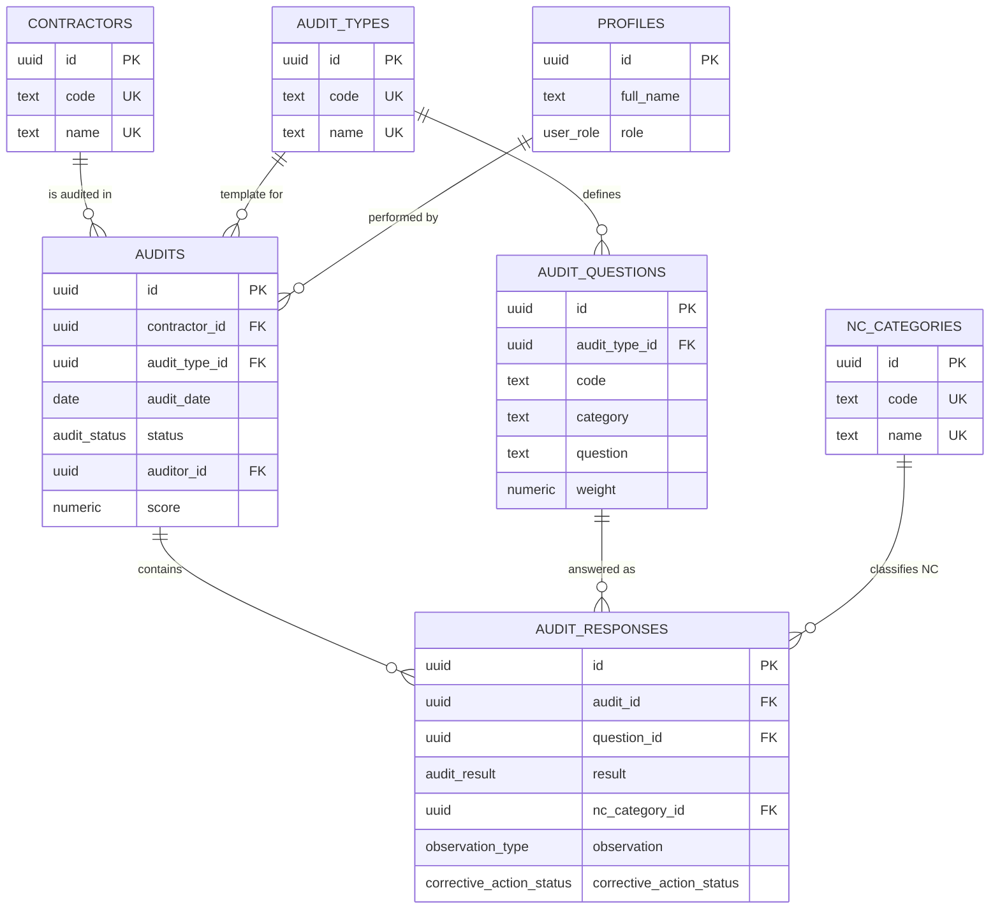

# Architecture — Contractor Audit Dashboard

## 1. Scope and guiding principle

> This application is an **audit analytics and compliance-trend platform**.
> It records structured, contractor-level audit results only and does not
> intentionally collect or store personal data, worker records, photographs,
> salary information, identification numbers, or individual welfare case
> information.

Design consequences:

- **Contractor-level only.** The subject of every record is an organization
  (`ABC Contracting — WMP-01 — Non-Compliant`), never a person.
- **No free text in the scoring path.** Every scoring field is an enum or a
  foreign key into a controlled vocabulary. This is enforced by the schema,
  not just the UI, and is what makes the trend analytics trustworthy:
  auditors cannot describe the same problem five different ways.
- The only personal data in the system is the application's own user accounts
  (Supabase Auth: email, display name, role) plus platform-level access logs —
  standard SaaS operational data, handled under the hosting approval.

## 2. Data model



Notable integrity rules (all database-enforced):

| Rule | Mechanism |
|---|---|
| NC classification is mandatory for Non-Compliance and forbidden otherwise | `CHECK ((result = 'non_compliance') = (nc_category_id IS NOT NULL))` |
| Corrective actions exist only on NC responses | `CHECK (corrective_action_status IS NULL OR result = 'non_compliance')` |
| One response per question per audit | `UNIQUE (audit_id, question_id)` |
| A response's question must belong to the audit's type | trigger `audit_responses_question_type_check` |
| Question weights are positive | `CHECK (weight > 0)` |

## 3. Scoring algorithm

Result outcomes and their scoring effect:

| Outcome | Effect |
|---|---|
| Full Compliance | question weight counts fully |
| Non-Compliance | question weight counts as zero + mandatory NC classification |
| Not Applicable | excluded from numerator **and** denominator |
| Observation (Positive Practice / Improvement Opportunity) | recorded on the response, never affects the score |

```
score = Σ weight(Full Compliance) / Σ weight(result ≠ Not Applicable) × 100
```

- Rounded to 2 decimals.
- An audit with zero applicable responses has **NULL** score, not 0% — an
  all-NA audit is "unscored", which matters for averages and trends.
- Weights default to 1.00 (straight percentage). Adopting criticality
  weighting later is a data change, not a code change.

Implementations (kept deliberately identical):

- **Database (source of truth):** `public.calculate_audit_score()`; a trigger
  on `audit_responses` keeps the denormalized `audits.score` current on every
  insert/update/delete.
- **Client (`src/lib/scoring.ts`):** live provisional score in the entry UI
  and dashboard aggregation without round-trips. The DB smoke test and the
  vitest suite pin the same example (3 FC + 1 NC + 1 NA → 75.00) so drift
  between the two gets caught.

## 4. NC classification system

Controlled taxonomy in `nc_categories` (seeded, admin-extendable):

| Code | Classification | Meaning |
|---|---|---|
| NC-NAV | Documentation Not Available | Required document/control doesn't exist |
| NC-NAP | Documentation Available but Not Approved | Document exists, required approval absent |
| NC-INC | Incomplete Documentation / Missing Requirements | Document exists, required elements missing |
| NC-NIM | Not Implemented | Document exists but isn't implemented |
| NC-PIM | Partially Implemented | Implementation is incomplete |
| NC-OTH | Other (Controlled) | Escape hatch — review periodically; recurring uses should be promoted to their own classification |

`NC-OTH` is a row in the controlled list, **not** a free-text field: even the
escape hatch stays aggregatable.

The observation layer is intentionally separate from the result, so
"Full Compliance + Positive Practice" is expressible without polluting the
scoring logic, and observations never appear in NC analytics.

## 5. Audit lifecycle

```
draft ──(auditor submits)──▶ submitted ──(admin approves)──▶ approved
```

- **draft** — private to the auditor (and admins); score updates live;
  excluded from every analytics view so half-entered audits never skew
  dashboards.
- **submitted** — visible to everyone; locked for the auditor; feeds
  analytics.
- **approved** — admin-verified; fully locked (admin can still correct or
  reopen).

Corrective-action tracking (`open → in_progress → closed → verified`) lives on
the NC response. While the audit is draft the auditor sets it; after
submission it is admin-maintained (a dedicated follow-up workflow is a
planned enhancement).

## 6. Dashboard / KPI structure

All analytics are SQL views (`0002_scoring.sql`), created with
`security_invoker = true` so RLS applies to the reader, and all restricted to
submitted/approved audits.

| View | Dashboard element | Question it answers |
|---|---|---|
| `v_contractor_latest_scores` | KPI tiles / contractor league table | "Where does each contractor stand right now?" |
| `v_audit_scores` | Score trend line per contractor & audit type | "Has ABC improved? (62 → 78 → 91)" |
| `v_nc_breakdown` | NC Pareto charts, filterable by contractor / question / category | "What is the most common NC cause?" / "What is ABC's main weakness?" |
| `v_question_performance` | Weakest-controls ranking | "Which controls fail program-wide?" |
| `v_open_corrective_actions` | Follow-up backlog | "What is still open, and for whom?" |
| `v_observations` | Positive-practice highlights | "Who is exceeding requirements?" (non-scoring) |

Suggested dashboard layout:

1. **Overview:** program average score, score distribution, top/bottom
   contractors, open corrective actions count.
2. **Contractor drill-down:** trend line, latest audit result by question
   category, NC breakdown for that contractor.
3. **Program analysis:** NC-category Pareto, weakest questions, category
   heat-map (contractor × question category).

## 7. Roles and row-level security

Roles live on `public.profiles` (`admin` / `auditor` / `viewer`), provisioned
automatically at signup (default `viewer`; admins promote). Helper
`current_user_role()` is `SECURITY DEFINER` to avoid RLS recursion on
`profiles`.

| Table | admin | auditor | viewer |
|---|---|---|---|
| contractors, audit_types, audit_questions, nc_categories | read/write | read | read |
| profiles | read/write all | read own | read own |
| audits | full, any status | create draft as self; edit/submit/delete **own drafts**; read own + all finalized | read finalized |
| audit_responses | full | edit within own drafts; read per parent audit | read within finalized audits |

Additional hardening:

- `anon` has no access at all — the dataset is internal.
- `audits.score` and `audits.auditor_id` are excluded from the column-level
  `UPDATE` grant: the score can only be written by the trigger, and audits
  cannot be reassigned by non-service roles.
- Role changes are admin-only (users cannot update their own profile row).
- Analytics views inherit the reader's RLS (`security_invoker`), so a viewer
  can never see draft data through a view.

All of this is asserted by `supabase/tests/smoke_test.sql`, which exercises
every role against a local Postgres using the shim in
`supabase/tests/harness.sql`.

## 8. Deployment

- **Supabase** — Postgres + Auth + RLS; migrations in `supabase/migrations/`
  apply cleanly with the Supabase CLI (`supabase db push` / `supabase db reset`).
- **Vercel** — Next.js frontend (not yet scaffolded), talking to Supabase with
  the anon key; RLS is the security boundary, so the frontend holds no
  privileged credentials.
- Because the audit dataset is organizational/compliance information rather
  than personal data, hosting is primarily an internal IT/security approval
  matter — confirm the project's approved cloud architecture before
  production data goes in.

## 9. Validation

```bash
npm install && npm test          # scoring library (vitest)
npm run typecheck                # strict TS
PGHOST=... PGUSER=postgres ./scripts/validate-db.sh   # full DB stack
```

The DB script builds a throwaway database, applies harness → migrations →
seed → smoke tests, and drops it. It needs any local Postgres 15+
(15 is the floor because views use `security_invoker`).
